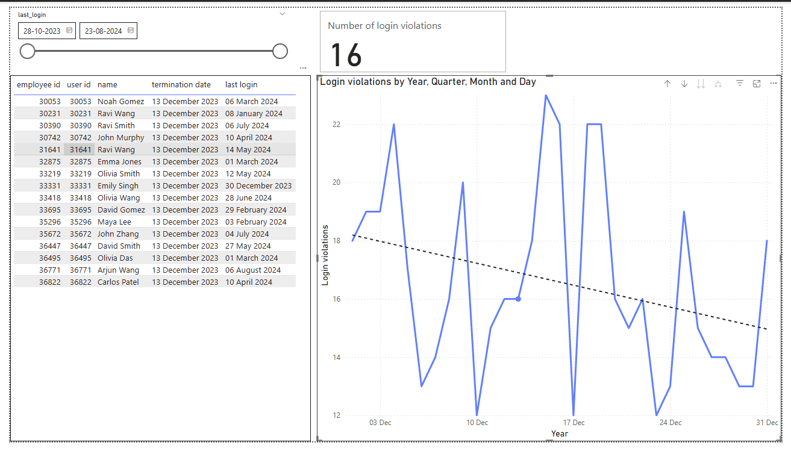

# 🛡️ Access Review Exception Reporting Tool

Simulates a common IT audit control test: identifying users who retain system access after termination. This project compares HR termination records with system login activity to flag potential violations, such as orphaned accounts or unauthorized access.

---

## 🚀 Project Overview

This tool demonstrates how data analytics supports IT audit processes. It identifies users whose system access was not removed after termination by:

- Matching HR termination data with system access logs
- Flagging users who logged in after their termination date
- Exporting an exception report for further audit review
- Visualizing exception trends using Power BI

---

## 🛠️ Tech Stack

- **Python** (Pandas): Data cleaning, joining, filtering
- **SQL Logic** (conceptual): Join and filter equivalents
- **Power BI**: Interactive dashboard for exception review
- **CSV**: Clean, portable file format for input/output

---

## 📁 Data Files

### Input:
- `terminated_employees_clean.csv`  
    HR records with employee ID, name, and termination date
- `user_access_logs_clean.csv`  
    System access logs with user ID, name, and last login date

### Output:
- `access_violations.csv`  
    Exception report showing post-termination logins

---

## 🧮 Audit Logic

1. Load HR and system data
2. Join on employee/user ID
3. Filter for logins after termination
4. Export results

```python
import pandas as pd

# Load data
terminated = pd.read_csv("terminated_employees_clean.csv")
access = pd.read_csv("user_access_logs_clean.csv")

# Convert dates
terminated["termination_date"] = pd.to_datetime(terminated["termination_date"])
access["last_login"] = pd.to_datetime(access["last_login"])

# Merge DataFrames on user/employee ID
merged = pd.merge(
        access,
        terminated,
        left_on='user_id',
        right_on='employee_id',
        how='inner'
)

# Filter for violations: logins after termination
 violations = merged[
        (merged['user_id'] == merged['employee_id']) &
        (merged['last_login'] > merged['termination_date'])
    ]

# Save results
violations.to_csv('access_violations.csv', index=False)
```

---

## 📊 Power BI Dashboard

To make the audit results reviewable by stakeholders and non-technical users, an interactive dashboard in Power BI includes:

- **Table**: Lists exception records (user ID, name, termination date, last login)
- **Card**: Displays the total number of violations
- **Line Chart**: Shows violation frequency over time
- **Slicer**: Enables filtering by date or employee

This dashboard makes it easier for audit teams to detect trends and focus on high-risk accounts.



---

## ✅ Features

- Realistic HR and access data structure (10K+ rows)
- Accurate exception detection logic (post-termination access)
- Scalable audit logic for enterprise datasets
- Beginner-friendly code with Power BI reporting

---

## 🧠 What I Learned

- How to simulate IT audit control tests with real-world logic
- Data merging and filtering with Pandas
- Basic audit analytics and access control validation
- Creating accessible dashboards in Power BI

---

## 📂 Folder Structure

```
├── terminated_employees_clean.csv
├── user_access_logs_clean.csv
├── access_violations.csv
├── auditScript.py
├── image.png
└── README.md
```

---

## 📬 Contact

Built by Ashutosh Gautam

- Website: [ashutoshgautam.io](https://ashutoshgautam.io)
- LinkedIn: [linkedin.com/in/ashutosh1g](https://linkedin.com/in/ashutosh1g)

---

## 📄 License

MIT License – use, modify, share.